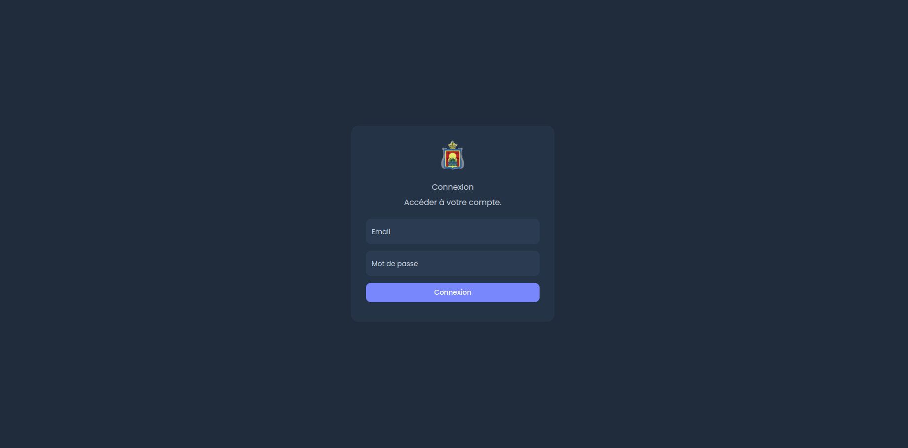
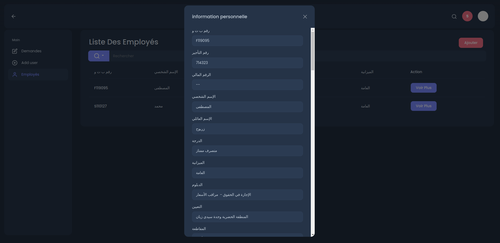

# stage-php-new
A personnal management web app built in PHP. 

<br>

<br>

<br>

<br>

<br>

<br>

<br>

<br>

<br>


## How to run it


These are the instruction how to run the app on your machine:

Clone the repo to your www folder or where you prefer `git clone https://github.com/Jakub41/Simple-PHP-Web-App.git `

This project was built in **PHP/MySQL** and need to be run under an app like **MAMP/WAMP/XAMP** 

If you use one of the app above be aware to clone the repo under your htdocs folder for have access through the localhost or configure your virtualhost and hosts file accordingly to your needs

Configure the `files/templates/dark-admin/ConnectDb.php` file with yours DB info.

Make sure to import the **bd_wilaya** in  a database with the same name in your ConnectDB.php file


## What was used

- PHP
- MySQL
- Materialize a CSS framework [Link](http://materializecss.com/)
- Jquery 
- HTML

## Login Info

<h4>Admin</h4>
id:

```
Z636129
```

password:

```
1234
```

<h4>user</h4>
id:

```
J636129
```

password:

```
1234
```
